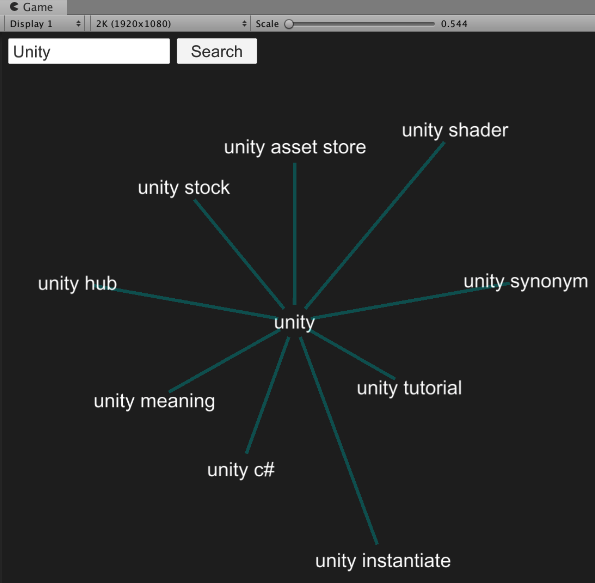
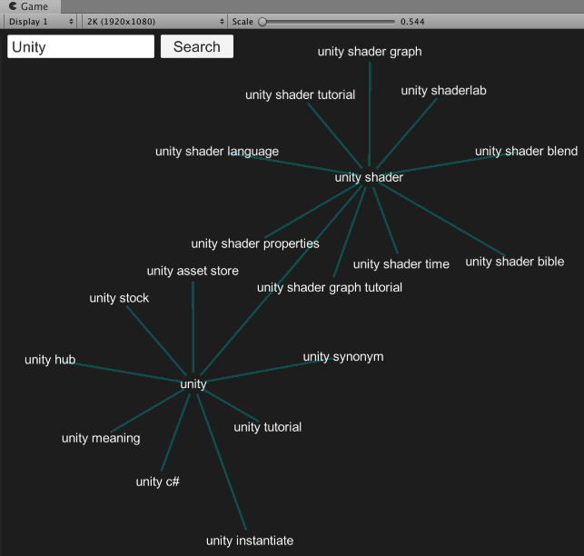
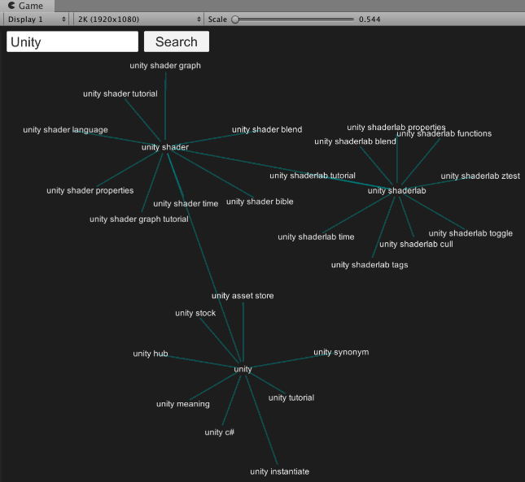
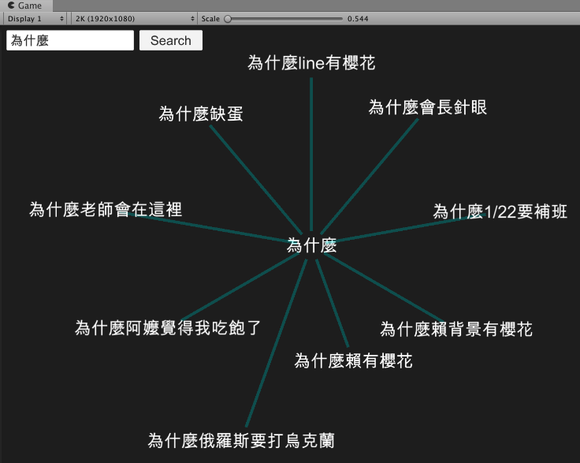

# GoogleSuggestGraph
The Google Suggest Graph provides an easy way to visualize the Google Suggest results with force directed graph.

## How to Use
1. Enter the text you want to search.
2. Mouse Left and Middle to drag the whole view.
3. Mouse Scroll to zoom in and out.
4. Click the result to find the suggestions.

